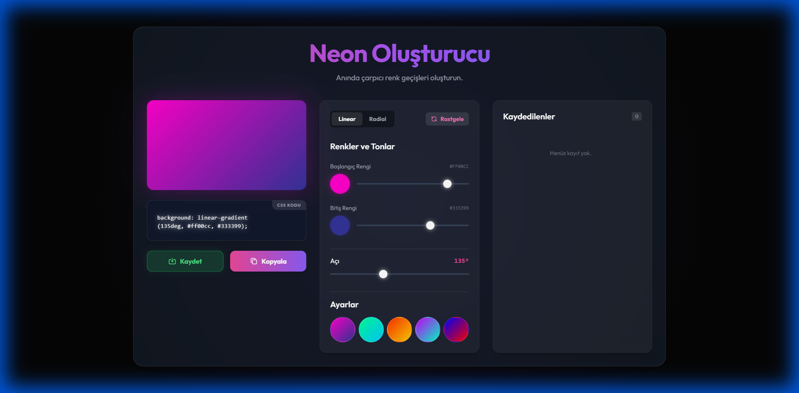

# Neon Renk Geçişi Oluşturucu (Neon Gradient Generator)

Modern, şık ve neon estetiğine sahip, CSS `linear-gradient` ve `radial-gradient` kodlarını anında oluşturmanızı sağlayan web tabanlı bir araçtır.

## 🌟 Özellikler

*   **Canlı Önizleme**: Renkleri ve açıyı değiştirdiğinizde anlık olarak sonucu görün.
*   **Neon Estetiği**: Koyu mod, "glassmorphism" paneller ve parlak neon efektleri.
*   **Tam Kontrol**:
    *   İki renk için ton (Hue) ayarı.
    *   Geçiş açısı (Angle) ayarı.
    *   Doğrusal (Linear) ve Radyal (Radial) geçiş desteği.
*   **Rastgele Oluştur**: "Rastgele" butonu ile sürpriz renk kombinasyonları keşfedin.
*   **Kaydetme Özelliği**: Beğendiğiniz geçişleri "Kaydet" butonu ile tarayıcı hafızasına (geçici olarak) kaydedin ve listeden tekrar yükleyin.
*   **Ayarlar Kütüphanesi**: Hazır, popüler neon renk paletlerinden seçim yapın.
*   **CSS Kopyalama**: Tek tıkla oluşturulan CSS kodunu panoya kopyalayın.
*   **Mobil Uyumlu**: Tüm cihazlarda sorunsuz çalışacak şekilde tasarlanmıştır.

## 🛠️ Teknolojiler

*   **HTML5**: Yapısal iskelet.
*   **Tailwind CSS (CDN)**: Hızlı ve modern stillendirme.
*   **JavaScript (Vanilla)**: Tüm interaktif özellikler ve mantık.
*   **Google Fonts**: "Outfit" font ailesi.

## 🚀 Kurulum ve Kullanım

Bu proje tek bir HTML dosyasından oluşur. Herhangi bir kuruluma, sunucuya veya derleme işlemine ihtiyaç duymaz.

1.  Repoyu klonlayın veya indirin.
2.  `neon_gradient_generator.html` dosyasını tarayıcınızda (Chrome, Firefox, Edge vb.) açın.
3.  Hemen kullanmaya başlayın!

## 📸 Ekran Görüntüleri

## 🤝 Katkıda Bulunma

Her türlü katkıya açığız! Hata bildirimleri veya özellik istekleri için lütfen "Issues" kısmını kullanın veya bir "Pull Request" gönderin.

---

*Google DeepMind Antigravity AI Asistanı ile geliştirilmiştir.*
