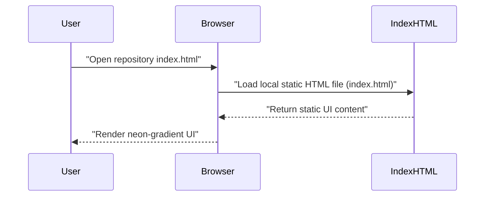

# System Blueprint: YusuffBulbul/Neon-Gradient-Generator

> Architecture analysis
>
> Auto-generated on 2026-09-07 by Repo-to-Blueprint Architect

## Project Purpose
A single-page, static web project named "Neon-Gradient-Generator" (repository name) implemented as an HTML entry point (index.html) with an included screenshot (screenshot.png). The repo appears to provide a client-side neon gradient generator UI (inferred from repository name and presence of index.html and screenshot.png).

## Technical Stack
- **Language**: HTML (index.html)
- **Framework**: None specified (no dependency manifest files present)
- **Key Dependencies**: None specified (no package.json, requirements.txt, pyproject.toml, go.mod, Cargo.toml found)
- **Infrastructure**: (none)

## Architecture Blueprint

```mermaid
flowchart TD
  subgraph Frontend
    INDEX["index.html"]
  end
  subgraph RepositoryFiles
    README["README.md"]
    GITIGNORE[".gitignore"]
    SCREENSHOT["screenshot.png"]
  end
  INDEX -->|"co-located with"| README
  INDEX -->|"co-located with"| SCREENSHOT
  INDEX -->|"co-located with"| GITIGNORE
  end

  style INDEX fill:#1f6feb,stroke:#58a6ff,color:#fff
  style README fill:#8b949e,stroke:#c9d1d9,color:#fff
  style GITIGNORE fill:#8b949e,stroke:#c9d1d9,color:#fff
  style SCREENSHOT fill:#8b949e,stroke:#c9d1d9,color:#fff

```

## Request Flow



## Evidence-Based Risks
1. Missing dependency manifests — repository contains only index.html, README.md, .gitignore, and screenshot.png (file tree); no package.json / requirements.txt / pyproject.toml / go.mod / Cargo.toml, so external dependencies and reproducible build information are not declared.
2. No server-side or supporting code present — only a single HTML entry point (index.html) and static files (screenshot.png), indicating there is no backend implementation in this repository if one is required by the application.
3. No tests or automation files — repository contains four files (index.html, README.md, .gitignore, screenshot.png) and no test directories or build scripts, increasing risk of regressions and lack of automated verification.

---

## Repository Stats
| Metric | Value |
|--------|-------|
| Total Files | 4 |
| Total Directories | 0 |
| Generated | 2026-09-07 |
| Source | [YusuffBulbul/Neon-Gradient-Generator](https://github.com/YusuffBulbul/Neon-Gradient-Generator) |

---

*Generated by Repo-to-Blueprint Architect via n8n*
